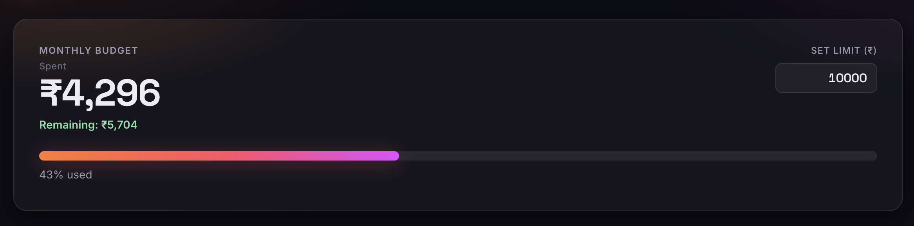
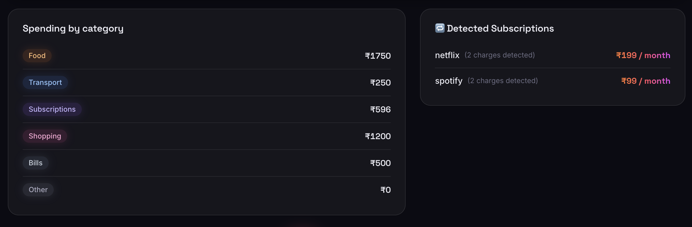
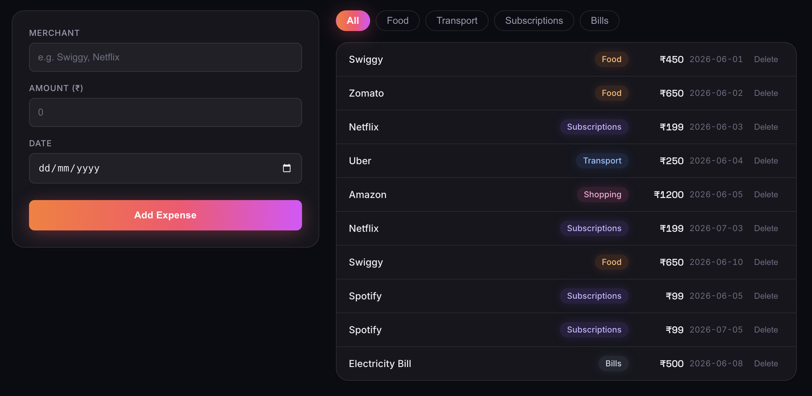

# Money Tracker

A spending & subscription tracker for Indian students and freelancers.

**[Live Demo](https://money-tracker-drab-tau.vercel.app/)** · **[GitHub](https://github.com/dhruv-bamal/money-tracker)**

# Budget Bar



# Category Division, Recurring Section



# Expense List



## What it does

- **Auto-categorizes expenses** by merchant name — type "Swiggy" and it
  automatically tags it as Food, no manual selection needed.
- **Detects recurring subscriptions** — add Netflix twice at the same
  amount and it flags the pattern with a 🔁 badge.
- **Budget tracking** — set a monthly limit, watch a progress bar fill
  green → amber → red as you spend.
- **Persists across sessions** — data survives page refreshes via
  localStorage (real database coming in Phase 2).
- **Category filtering** — filter expenses by Food, Transport,
  Subscriptions, or see all at once.

## Tech

| Layer       | Choice       | Why                       |
| ----------- | ------------ | ------------------------- |
| Framework   | React 18     | Component model, hooks    |
| Language    | TypeScript   | Catch bugs before runtime |
| Build tool  | Vite         | Instant HMR, fast builds  |
| Styling     | CSS Modules  | Scoped, no runtime cost   |
| Persistence | localStorage | No backend yet            |

**No UI library.** Every component is hand-built

## Run locally

```bash
git clone https://github.com/dhruv-bamal/money-tracker.git
cd money-tracker
npm install
npm run dev
```

Open `http://localhost:5173`.

## Project structure

```text
src/
├── App.tsx              # Orchestrator — state, handlers, layout
├── types.ts             # Shared TypeScript interfaces
├── components/          # React UI components
│   ├── Header.tsx
│   ├── BudgetBar.tsx    # Budget state + progress bar + Budget class
│   ├── Summary.tsx      # Category totals
│   ├── RecurringSection.tsx
│   ├── AddExpenseForm.tsx
│   ├── ExpenseList.tsx
│   └── ExpenseItem.tsx
├── lib/                 # Business logic — no React dependency
│   ├── logic.ts         # categorize(), totalByCategory(), detectRecurring()
│   ├── Budget.ts        # Budget class — OOP encapsulation
│   └── data.ts          # Seed data
└── styles/              # CSS modules
```

The `lib/` functions are framework-independent — they run identically
in Node, in a serverless function, or in a React component. This was
a deliberate choice to separate logic from UI.

_Follow along on
[LinkedIn](https://linkedin.com/in/dhruv-bamal)._

### POST /api/auth/signup

Creates a new account. **Response 201:** `{ token, user: { id, email, created_at } }`.
**Response 400:** missing fields or password under 8 characters.
**Response 409:** email already registered.

### POST /api/auth/login

**Response 200:** `{ token, user: { id, email } }`.
**Response 401:** invalid email or password (same message for both cases — prevents user enumeration).

### Auth on protected routes

`/api/transactions` and `/api/summary` now require `Authorization: Bearer <token>`.
**Response 401:** missing or invalid token.
Every query is scoped to the authenticated user — no cross-account data access.

## Security note

Auth tokens are stored in localStorage for simplicity. This is readable by
any JS running on the page (XSS risk). A production app would use httpOnly
cookies instead, which aren't accessible to JavaScript — but that requires
backend cookie handling and CSRF protection. Documented tradeoff, not an
oversight.
